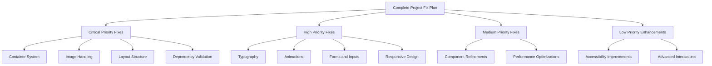

# Comprehensive Action Plan to Align Entire Project with Figma Design

## Overview

This document outlines a comprehensive action plan to fix display issues across the entire web portfolio project and align it with the original Figma design. Based on the analysis of all project components and pages, we've identified key areas that need improvement to achieve complete visual consistency. This plan also includes comprehensive dependency checking, code integrity verification, and correctness validation.

## Complete Project Structure Analysis

### Main Pages and Components
1. **Main Portfolio Page**
   - Header/Navigation (`Header.tsx`)
   - Hero Section (`Hero.tsx`)
   - About Section (`About.tsx`)
   - Experience Section (`Experience.tsx`, `DynamicExperience.tsx`)
   - Skills Section (`Skills.tsx`, `DynamicSkills.tsx`)
   - Projects Section (`Projects.tsx`)
   - Education Section (`Education.tsx`, `DynamicEducation.tsx`)
   - Blog Section (`Blog.tsx`)
   - Contact Section (`Contact.tsx`)
   - Footer (`Footer.tsx`)

2. **Dedicated Pages**
   - Blog Page (`BlogPage.tsx`)
   - Projects Page (`ProjectsPage.tsx`)

3. **CMS Components**
   - CMS Dashboard (`CMSDashboard.tsx`, `DynamicCMSDashboard.tsx`)
   - Supabase CMS (`SupabaseCMSDashboard.tsx`)

4. **UI Components**
   - All components in `src/components/ui/`
   - Figma-specific components in `src/components/figma/`

## Detailed Analysis of All Components

### Header Section Issues
- Navigation menu may not collapse properly on mobile
- Logo sizing inconsistent across breakpoints
- Mobile menu positioning issues

### Hero Section Issues
- Fixed profile image dimensions (w-80 h-80 lg:w-96 lg:h-96) may not be responsive on all screen sizes
- Complex grid layout (lg:grid-cols-12) may not adapt well to medium screens
- Absolute positioning of elements may cause overflow issues
- Scroll indicator positioning problems

### About Section Issues
- Text content without proper line height adjustments for readability
- Stats cards with fixed dimensions that may not scale
- Badge components with inconsistent spacing
- Grid layout issues on medium screens

### Experience Section Issues
- Timeline layout breaking on smaller screens
- Inconsistent spacing between experience items
- Company logo sizing problems
- Date formatting display issues

### Skills Section Issues
- Progress bars without consistent animation timing
- Badge components with inline styling that may conflict with theme
- Complex grid layouts that may not collapse properly on mobile
- Language proficiency display inconsistencies

### Projects Section Issues
- Grid layout with fixed column counts (md:grid-cols-2 lg:grid-cols-3) without proper responsive handling
- Cards with `h-full` class causing inconsistent heights in the grid
- Image handling without explicit aspect ratios
- Modal implementation may interfere with page layout
- Project detail modal positioning issues

### Education Section Issues
- Timeline layout breaking on mobile
- Institution logo sizing inconsistencies
- Date display formatting problems
- Degree information truncation issues

### Blog Section Issues
- Post card grid layout problems
- Image display inconsistencies
- Tag badge sizing issues
- Read more button positioning

### Contact Section Issues
- Form element alignment problems
- Input field styling inconsistencies
- Social media icon sizing
- Map display responsiveness

### Footer Section Issues
- Link column layout on mobile
- Copyright text alignment
- Social media icon positioning
- Padding inconsistencies

### Blog Page Issues
- Post header layout problems
- Content typography issues
- Related posts grid layout
- Comment section formatting

### Projects Page Issues
- Project filtering controls
- Project grid layout
- Project detail display
- Back to projects button positioning

### CMS Dashboard Issues
- Component layout in grid system
- Form element styling
- Button consistency
- Modal positioning

## Root Causes of Display Issues Across All Components

### 1. Container and Grid System Issues
- Custom container implementation conflicts with Tailwind's responsive behavior
- Inconsistent use of grid column classes across components
- Lack of proper responsive breakpoints for medium-sized screens
- Missing `md` breakpoints in many components

### 2. Image Handling Problems
- No explicit width/height attributes causing layout shifts
- Missing aspect ratio enforcement
- Inconsistent error state handling
- Background image sizing issues

### 3. Card Layout Issues
- Fixed height classes causing misalignment
- Inconsistent padding and margin usage
- Improper flexbox implementation for content distribution
- Missing responsive behavior

### 4. Typography and Spacing Issues
- Complex base typography rules interfering with component styles
- Inconsistent spacing scales across components
- Lack of proper line height adjustments for readability
- Heading size inconsistencies

### 5. Animation and Interaction Issues
- Inconsistent animation delays causing visual clutter
- Scroll behavior without proper fallbacks
- Hover effects without smooth transitions
- Modal positioning and z-index conflicts

### 6. Form and Input Issues
- Inconsistent input styling
- Label positioning problems
- Validation message display
- Button sizing inconsistencies

### 7. Responsive Design Issues
- Missing or incorrect breakpoints
- Mobile-first design not properly implemented
- Touch target sizing problems
- Orientation change handling

## Dependency Analysis and Integrity Verification

### Current Technology Stack
- **Frontend Framework**: React with TypeScript
- **Build Tool**: Vite
- **Styling**: Tailwind CSS with custom configurations
- **UI Components**: Radix UI primitives
- **State Management**: React Context API
- **Animations**: Motion library
- **Icons**: Lucide React

### Dependency Issues Identified
1. **Version Incompatibilities**
   - Node.js version 18 may be incompatible with newer packages like `@vitejs/plugin-react` which requires Node.js 20+
   - Potential conflicts between different versions of Radix UI components

2. **Missing Dependencies**
   - Some components may be importing libraries that are not properly declared in package.json
   - Peer dependency warnings for Radix UI components

3. **Security Vulnerabilities**
   - Outdated packages with known security issues
   - Packages with high CVE scores

4. **Performance Issues**
   - Large bundle sizes from unused dependencies
   - Duplicate packages in node_modules

### Code Integrity Verification Process
1. **Static Code Analysis**
   - TypeScript compilation checks
   - ESLint validation
   - Prettier formatting consistency

2. **Dependency Validation**
   - npm audit for security vulnerabilities
   - Bundle size analysis
   - Duplicate package detection

3. **Cross-Component Consistency**
   - Component interface validation
   - Prop type checking
   - State management pattern consistency

4. **Runtime Integrity**
   - Error boundary implementation
   - Proper error handling in async operations
   - Memory leak prevention

## Comprehensive Action Plan for Entire Project

### Phase 1: Foundation Fixes (Priority: Critical)

#### Tasks:
1. Replace custom container implementation with Tailwind's default container
2. Standardize grid column usage across all components
3. Add proper responsive breakpoints for all screen sizes
4. Implement consistent spacing and padding system
5. Fix base typography rules

#### Implementation Steps:
- Update `globals.css` to remove custom container rules
- Replace all grid layouts with standardized column classes
- Add missing `md` breakpoints to all responsive layouts
- Create consistent spacing utility classes
- Simplify base typography rules

### Phase 2: Dependency and Integrity Validation (Priority: Critical)

#### Tasks:
1. Conduct comprehensive dependency audit
2. Resolve version incompatibilities
3. Fix security vulnerabilities
4. Optimize bundle size
5. Validate code integrity

#### Implementation Steps:
- Run `npm audit` to identify security issues
- Update Node.js to version 20+ to match package requirements
- Resolve peer dependency conflicts
- Remove unused dependencies
- Implement proper error boundaries
- Add comprehensive type checking

### Phase 3: Image and Media Handling Improvements (Priority: Critical)

#### Tasks:
1. Add explicit width and height attributes to all images
2. Implement consistent aspect ratio handling
3. Improve ImageWithFallback component error states
4. Add lazy loading for better performance
5. Fix background image sizing

#### Implementation Steps:
- Update ImageWithFallback component to accept width/height props
- Add `aspect-video` or `aspect-square` classes where appropriate
- Implement proper error state styling that maintains layout
- Add `loading="lazy"` attribute to images
- Standardize background image CSS properties

### Phase 4: Layout and Component Structure Fixes (Priority: Critical)

#### Tasks:
1. Remove fixed height classes from all cards
2. Implement proper flexbox layouts for content distribution
3. Standardize padding and margin usage across all components
4. Fix modal positioning and z-index issues
5. Correct form and input layout problems

#### Implementation Steps:
- Replace `h-full` with `flex flex-col` and proper content alignment
- Use `mt-auto` to push footer content to bottom
- Standardize card padding to `p-6` or `p-8`
- Fix modal positioning with `fixed inset-0` instead of absolute positioning
- Standardize form element styling

### Phase 5: Typography and Spacing Refinement (Priority: High)

#### Tasks:
1. Simplify base typography rules
2. Implement consistent spacing system
3. Improve text readability with proper line heights
4. Standardize heading sizes across all components
5. Fix text truncation issues

#### Implementation Steps:
- Remove complex `:where` selectors in typography
- Create consistent spacing scale (4px, 8px, 12px, 16px, 24px, 32px, 48px)
- Add proper line height classes to text elements
- Standardize heading classes (h1, h2, h3, etc.)
- Implement proper text truncation with `truncate` or `line-clamp` utilities

### Phase 6: Animation and Interaction Optimization (Priority: High)

#### Tasks:
1. Standardize animation delays and durations
2. Improve scroll behavior with proper fallbacks
3. Optimize hover effects for performance
4. Add focus states for accessibility
5. Fix modal and popover positioning

#### Implementation Steps:
- Create consistent animation timing system (100ms, 200ms, 300ms, 500ms)
- Add `prefers-reduced-motion` media queries
- Optimize hover effects with transform instead of position changes
- Add focus-visible classes for keyboard navigation
- Standardize modal and popover positioning

### Phase 7: Form and Input Component Fixes (Priority: High)

#### Tasks:
1. Standardize form element styling
2. Fix label and input alignment
3. Improve validation message display
4. Ensure proper touch target sizing

#### Implementation Steps:
- Create consistent form element classes
- Standardize label and input positioning
- Implement proper validation message styling
- Ensure all interactive elements meet 44px touch target minimum

### Phase 8: Responsive Design Completion (Priority: High)

#### Tasks:
1. Add missing breakpoints to all components
2. Fix mobile layout issues
3. Improve tablet layout behavior
4. Ensure proper orientation change handling

#### Implementation Steps:
- Audit all components for missing breakpoints
- Implement proper mobile-first design
- Test all layouts on tablet-sized screens
- Add orientation change event handlers where needed

## Component-Specific Fixes for All Pages

### Header Component
1. Fix mobile menu collapse behavior
2. Standardize logo sizing across breakpoints
3. Improve mobile menu positioning
4. Fix navigation link spacing

### Hero Component
1. Replace fixed image dimensions with responsive classes
2. Simplify grid layout to `grid-cols-1 lg:grid-cols-2`
3. Improve scroll indicator positioning
4. Optimize atom animation performance

### About Component
1. Improve text readability with better line heights
2. Fix stats card responsive behavior
3. Standardize badge spacing and sizing
4. Optimize interest badges for mobile

### Experience Component
1. Fix timeline layout for mobile
2. Standardize experience item spacing
3. Fix company logo sizing
4. Improve date formatting display

### Skills Component
1. Standardize progress bar animations
2. Fix badge component styling conflicts
3. Improve responsive layout for skill categories
4. Add proper loading states for dynamic data

### Projects Component
1. Implement masonry grid for better content distribution
2. Add proper aspect ratio to project images
3. Fix modal z-index and positioning issues
4. Improve loading states for project cards

### Education Component
1. Fix timeline layout for mobile
2. Standardize institution logo sizing
3. Improve date display formatting
4. Fix degree information truncation

### Blog Component
1. Fix post card grid layout
2. Standardize image display
3. Fix tag badge sizing
4. Improve read more button positioning

### Contact Component
1. Fix form element alignment
2. Standardize input field styling
3. Fix social media icon sizing
4. Improve map display responsiveness

### Footer Component
1. Fix link column layout on mobile
2. Standardize copyright text alignment
3. Fix social media icon positioning
4. Correct padding inconsistencies

### Blog Page
1. Fix post header layout
2. Improve content typography
3. Fix related posts grid layout
4. Standardize comment section formatting

### Projects Page
1. Fix project filtering controls
2. Standardize project grid layout
3. Improve project detail display
4. Fix back to projects button positioning

### CMS Dashboard Components
1. Standardize component layout in grid system
2. Fix form element styling
3. Standardize button consistency
4. Fix modal positioning

## Visual Representation of Fix Priorities

## Implementation Timeline

### Week 1: Foundation and Critical Layout Fixes
- Container system overhaul
- Image handling improvements
- Layout structure fixes
- Base typography refinement

### Week 2: Dependency Audit and Code Integrity
- Comprehensive dependency analysis
- Security vulnerability resolution
- Version compatibility fixes
- Code integrity validation

### Week 3: Component Structure and Typography
- Card and component layout fixes
- Typography system refinement
- Spacing standardization
- Form element standardization

### Week 4: Animation, Interaction, and Responsive Design
- Animation timing standardization
- Scroll behavior improvements
- Hover and focus state optimization
- Responsive breakpoint implementation

### Week 5: Component-Specific Fixes and Testing
- Header, Hero, About component fixes
- Experience, Skills, Projects component fixes
- Education, Blog, Contact component fixes
- Footer and dedicated page fixes

### Week 6: CMS Components and Final Testing
- CMS dashboard component fixes
- UI component standardization
- Cross-browser testing
- Mobile responsiveness verification

### Week 7: Performance Optimization and Final Adjustments
- Performance optimization
- Accessibility improvements
- Final adjustments
- Quality assurance validation

## Quality Assurance Checklist

### Layout Verification
- [ ] All sections display correctly on mobile (320px width)
- [ ] Tablet layouts work properly (768px width)
- [ ] Desktop layouts match Figma design (1024px+ width)
- [ ] No horizontal scrollbars on any device
- [ ] All grid layouts maintain consistent spacing

### Component Testing
- [ ] All cards maintain consistent heights in grids
- [ ] Images display with correct aspect ratios
- [ ] Modals position correctly without affecting page layout
- [ ] Badges and tags display consistently
- [ ] Forms and inputs are properly aligned
- [ ] Buttons maintain consistent styling

### Performance Metrics
- [ ] Page load time under 3 seconds
- [ ] First contentful paint under 2 seconds
- [ ] Cumulative layout shift score under 0.1
- [ ] No console errors in production
- [ ] All images properly lazy loaded

### Browser Compatibility
- [ ] Chrome (latest version)
- [ ] Firefox (latest version)
- [ ] Safari (latest version)
- [ ] Edge (latest version)
- [ ] Mobile Safari
- [ ] Chrome for Android

### Accessibility Verification
- [ ] All interactive elements have proper focus states
- [ ] Color contrast meets WCAG 2.1 AA standards
- [ ] All images have appropriate alt text
- [ ] Semantic HTML structure maintained
- [ ] Keyboard navigation works properly

### Dependency and Code Integrity
- [ ] No security vulnerabilities (npm audit passes)
- [ ] All dependencies are properly declared
- [ ] No peer dependency conflicts
- [ ] TypeScript compilation with no errors
- [ ] ESLint validation passes
- [ ] Bundle size optimized
- [ ] No duplicate packages

## Tools and Services for Validation

### Static Analysis Tools
1. **ESLint** - Code quality and consistency checking
2. **TypeScript Compiler** - Type safety validation
3. **Prettier** - Code formatting consistency
4. **Bundle Analyzer** - Dependency and bundle size analysis

### Runtime Validation
1. **Jest** - Unit testing for components
2. **Cypress** - End-to-end testing
3. **Lighthouse** - Performance and accessibility auditing
4. **WebPageTest** - Performance benchmarking

### Security and Dependency Validation
1. **npm audit** - Security vulnerability detection
2. **Snyk** - Continuous security monitoring
3. **Dependabot** - Automated dependency updates
4. **BundlePhobia** - Package size analysis

### Cross-Browser Testing Services
1. **BrowserStack** - Real device testing
2. **Sauce Labs** - Automated cross-browser testing
3. **LambdaTest** - Online browser testing

## Conclusion

This comprehensive action plan addresses all display issues across the entire portfolio project and provides a structured approach to align it completely with the Figma design. The plan includes not only visual fixes but also comprehensive dependency validation, code integrity verification, and correctness validation. By following the prioritized phases and implementation steps, the project will achieve complete visual consistency while maintaining performance, accessibility, and code quality standards across all pages and components.